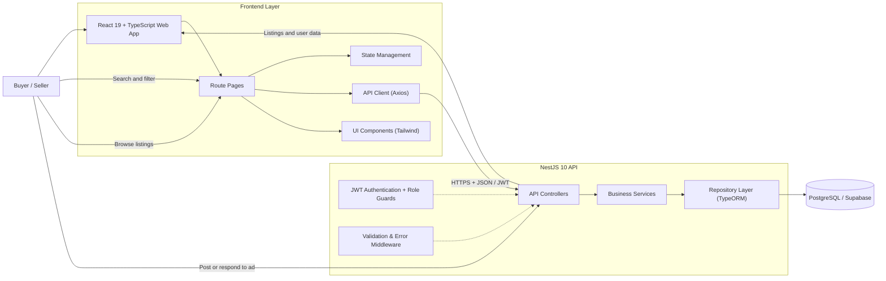

# 🏬 ReSello

**Buy, Sell & Trade Anything Classified.**

A full-stack classified ads marketplace platform built with NestJS and React — browse, post, and manage listings across multiple categories with location-based search and user authentication.

[](https://nestjs.com/)
[](https://react.dev/)
[](https://www.typescriptlang.org/)
[](https://www.postgresql.org/)
[](https://tailwindcss.com/)

---

## ✨ Features

| Category | Details |
|---|---|
| 🔍 **Advanced Search** | Filter by category, location, price range, and custom attributes |
| 📍 **Location-Based** | View ads near you with location filtering and locality support |
| 📝 **Post Listings** | Create classified ads with images, descriptions, and pricing |
| 🏷️ **Multi-Category** | Three-level hierarchy: Parent → Sub → Leaf categories |
| 👤 **User Authentication** | Secure JWT-based login/signup with buyer & seller roles |
| 📊 **Dashboard** | Manage posted ads, view responses, and track account activity |
| 📱 **Responsive Design** | Mobile-first design with Professional Blue & Teal theme |
| 🔐 **Data Protection** | Parameterized queries, input validation, and secure authentication |

---

## 🏗️ Architecture & Application Flow

ReSello follows a layered full-stack architecture. The React frontend handles the user experience, the NestJS API manages business logic and authentication, and TypeORM provides type-safe database access to PostgreSQL.



### Typical User Journey

1. A visitor browses classified ads by category, location, or search keyword.
2. The frontend requests listings from the API and displays results with filters.
3. After authentication, users can save ads and post new listings.
4. Sellers manage their posted ads and view buyer responses from the dashboard.
5. All communications are secure with JWT token-based authentication.

---

## 🛠️ Tech Stack

| Layer | Technology |
|---|---|
| **Frontend** | React 19, TypeScript, Vite, Tailwind CSS 4 |
| **UI Components** | Custom components, Tailwind utilities |
| **HTTP Client** | Axios |
| **State Management** | React hooks + Context API |
| **Routing** | React Router v6 |
| **Backend** | NestJS 10, TypeScript |
| **ORM / Data** | TypeORM |
| **Database** | PostgreSQL (v14+) |
| **Auth** | JWT Bearer tokens with Passport |
| **API Docs** | Swagger / OpenAPI |
| **Validation** | class-validator, class-transformer |

---

## 📋 Prerequisites

Before you begin, ensure you have the following installed:

| Tool | Version | Download |
|---|---|---|
| **Node.js** | v18+ | [nodejs.org](https://nodejs.org/) |
| **npm** | v9+ | Included with Node.js |
| **PostgreSQL** | v14+ | [postgresql.org](https://www.postgresql.org/download/) |
| **Git** | Latest | [git-scm.com](https://git-scm.com/) |

---

## 🚀 Getting Started

### 1. Clone the Repository

```bash
git clone https://github.com/yourusername/resello.git
cd resello
```

### 2. Set Up the Database (PostgreSQL)

1. Create a new PostgreSQL database:
```bash
createdb resello_clone
```

2. Or use psql:
```sql
CREATE DATABASE resello_clone;
```

### 3. Set Up the Backend (NestJS)

```bash
cd backend
```

Install dependencies:
```bash
npm install
```

Create the environment file:
```bash
cp .env.example .env
```

Update the `.env` file with your database credentials:
```
DATABASE_HOST=localhost
DATABASE_PORT=5432
DATABASE_USER=postgres
DATABASE_PASSWORD=your_password
DATABASE_NAME=resello_clone
JWT_SECRET=your_64_character_random_secret_key_here_make_it_long
JWT_EXPIRES_IN=7d
PORT=3000
CORS_ORIGIN=http://localhost:5173
```

Start the development server:
```bash
npm run start:dev
```

The API will start at `http://localhost:3000`. Swagger docs are available at `http://localhost:3000/api/docs`.

### 5. Populate Dummy Data (Optional but Recommended)

To populate the database with sample data for development and testing:

```bash
cd backend
```

Run migrations to create tables:
```bash
npm run migration:run
```

Seed the database with dummy data:
```bash
npm run seed
```

Or seed specific data types individually:
```bash
npm run seed:cities      # Populate cities
npm run seed:categories  # Populate categories (ReSelloBazar, ReSelloCars, etc.)
npm run seed:users       # Create sample buyers and sellers
npm run seed:ads         # Generate sample listings
npm run seed:images      # Add images to listings
```

This will populate your database with:
- ✅ 50+ Indian cities
- ✅ 7 parent categories with 30+ sub-categories
- ✅ 10+ sample users (buyers and sellers)
- ✅ 100+ classified ads across categories
- ✅ Product images for listings

### 6. Set Up the Frontend (React + Vite)

```bash
cd frontend
```

Create the environment file:
```bash
cp .env.example .env
```

Update `.env`:
```
VITE_API_BASE_URL=http://localhost:3000
```

Install dependencies and start:
```bash
npm install
npm run dev
```

The frontend will start at `http://localhost:5173`.

---

## 📁 Project Structure

```
resello/
├── backend/                        # NestJS API
│   ├── src/
│   │   ├── ads/                    # Ad listing module
│   │   │   ├── ads.controller.ts
│   │   │   ├── ads.service.ts
│   │   │   ├── dto/
│   │   │   └── entities/
│   │   ├── auth/                   # Authentication module
│   │   │   ├── auth.controller.ts
│   │   │   ├── auth.service.ts
│   │   │   ├── guards/
│   │   │   └── strategies/
│   │   ├── categories/             # Category module
│   │   │   ├── categories.service.ts
│   │   │   └── entities/
│   │   ├── common/                 # Shared utilities
│   │   │   ├── decorators/
│   │   │   ├── filters/
│   │   │   └── pipes/
│   │   ├── database/               # Database config
│   │   │   ├── migrations/
│   │   │   └── seeders/
│   │   ├── app.module.ts
│   │   └── main.ts
│   ├── .env.example
│   └── package.json
│
├── frontend/                       # React + Vite App
│   ├── src/
│   │   ├── components/             # Reusable React components
│   │   │   ├── Header.tsx
│   │   │   ├── Footer.tsx
│   │   │   ├── CategoryCard.tsx
│   │   │   ├── AuthModal.tsx
│   │   │   └── Layout.tsx
│   │   ├── pages/                  # Route pages
│   │   │   ├── HomePage.tsx
│   │   │   ├── SearchPage.tsx
│   │   │   └── CategoryPage.tsx
│   │   ├── lib/                    # Utilities & types
│   │   │   ├── api.ts
│   │   │   ├── constants.ts
│   │   │   └── types.ts
│   │   ├── App.tsx
│   │   ├── index.css               # Tailwind styles
│   │   └── main.tsx
│   ├── .env.example
│   ├── tailwind.config.js
│   └── package.json
│
├── .gitignore
├── README.md                       # This file
└── package.json
```

---

## 🔌 API Endpoints

The backend exposes these main API groups (see full docs at `/api/docs`):

| Method | Endpoint | Description |
|---|---|---|
| `POST` | `/api/auth/register` | Register new user |
| `POST` | `/api/auth/login` | Login with email + password |
| `POST` | `/api/auth/check-user` | Check if user exists |
| `GET` | `/api/categories` | List all categories |
| `GET` | `/api/ads` | List/search ads with filters |
| `GET` | `/api/ads/:id` | Get ad details |
| `POST` | `/api/ads` | Create new ad (auth required) |
| `PUT` | `/api/ads/:id` | Update ad (auth required) |
| `DELETE` | `/api/ads/:id` | Delete ad (auth required) |

---

## 🧪 Development

### Backend Commands

```bash
npm run start:dev    # Start dev server with hot reload
npm run build        # Build for production
npm run start:prod   # Start production server
npm run test         # Run tests
npm run lint         # Run ESLint
```

### Frontend Commands

```bash
npm run dev          # Start dev server
npm run build        # Production build
npm run preview      # Preview production build
npm run lint         # Run ESLint
```

---

## 🎨 Color Scheme

ReSello uses a **Professional Blue & Teal** theme for a modern, trustworthy marketplace experience:

| Color | Usage | Hex Value |
|---|---|---|
| **Primary Blue** | Buttons, links, headers | `#1e3a8a` - `#3b82f6` |
| **Accent Teal** | CTAs, highlights | `#0d9488` |
| **White** | Backgrounds | `#ffffff` |
| **Dark Gray** | Text | `#1f2937` |

---

## 🔐 Environment Variables

### Backend (.env)

```env
# Database
DATABASE_HOST=localhost
DATABASE_PORT=5432
DATABASE_USER=postgres
DATABASE_PASSWORD=your_secure_password
DATABASE_NAME=resello_clone

# JWT
JWT_SECRET=your_long_random_secret_key_minimum_32_characters
JWT_EXPIRES_IN=7d

# Server
PORT=3000
CORS_ORIGIN=http://localhost:5173
```

### Frontend (.env)

```env
VITE_API_BASE_URL=http://localhost:3000
```

---

## 🤝 Contributing

1. Fork the repository
2. Create a feature branch (`git checkout -b feature/amazing-feature`)
3. Commit your changes (`git commit -m 'Add amazing feature'`)
4. Push to the branch (`git push origin feature/amazing-feature`)
5. Open a Pull Request

---

## 📄 License

MIT License - feel free to use this project for educational and commercial purposes.

---

**Built with ❤️ as a modern classified marketplace**
